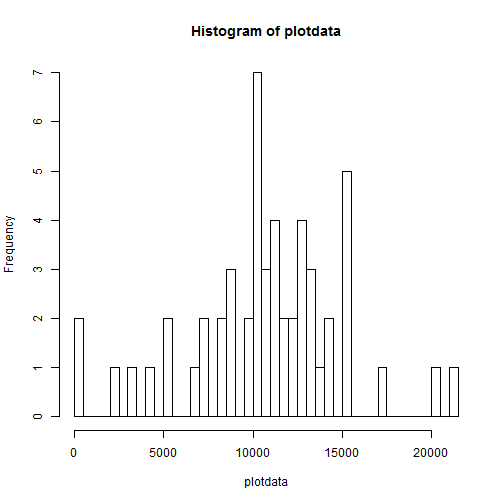
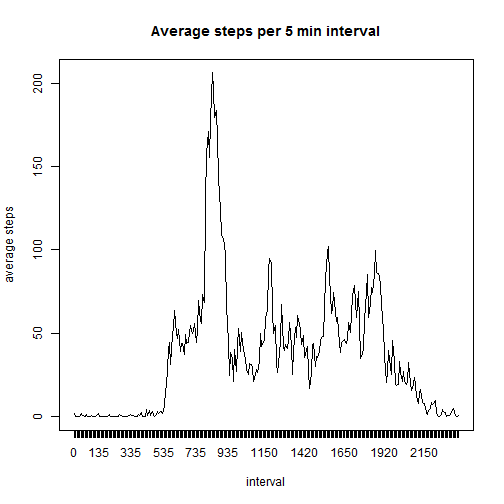
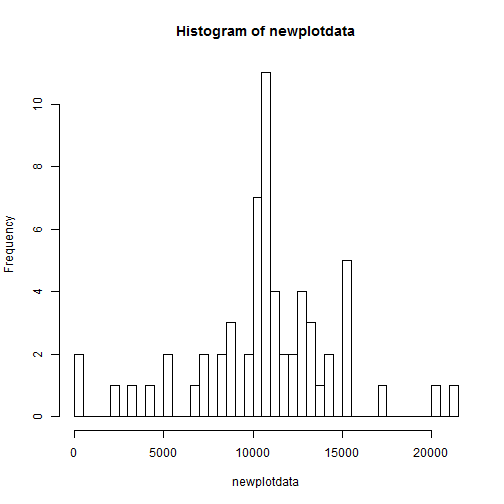
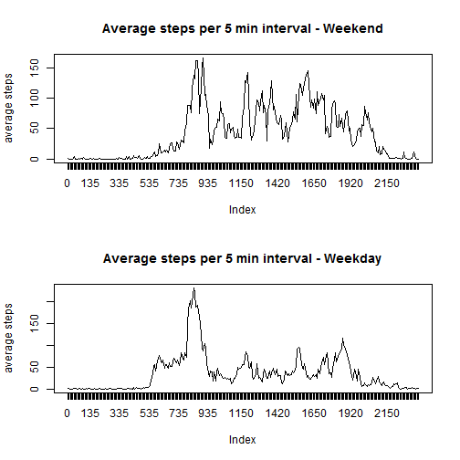

This is an R Markdown document for the Coursera Course on reproducible research assignment 1. 

There are multiple tasks in this analysis

* set the Working directory and load the data


```r
setwd(paste(getwd(),"/Rdata", sep=""))
steps<-read.csv("activity.csv")
steps$date<-as.Date(steps$date, format="%Y-%m-%d")
```

* create a Histogram of steps taken 


```r
# use tapply to create the data set for the histogram
plotdata<-tapply(steps$steps, steps$date, FUN=sum)
# and plot the data as a histogram
hist(plotdata, breaks=61)
```

 

* The mean number of steps taken per day

```r
mean(plotdata, na.rm=TRUE)
```

```
## [1] 10766.19
```

* the median of steps per day

```r
median(plotdata, na.rm=TRUE)
```

```
## [1] 10765
```


* Create a plot of Daily activity patterns

```r
plotdaily<-tapply(steps$steps, steps$interval, FUN=mean, na.rm=TRUE)
plot(plotdaily, type="l", ylab="average steps", xlab="interval", main="Average steps per 5 min interval", xaxt="n")
xnames<-names(plotdaily)
axis(1, at=1:length(xnames), labels=xnames)
```

 

* the 5 minute interval which contained the maximum steps 

```r
names(which.max(plotdaily))
```

```
## [1] "835"
```

# Inputting missing Values

* The total number of missing values (NA) in the data is

```r
sum(is.na(steps))
```

```
## [1] 2304
```

* For these missing values, i will fill in the missing values with the mean value for that interval


```r
# I will split the data to Good Data (with no NAs)
steps1<-as.data.frame(steps)
GoodData<-subset(steps1, is.na(steps1$steps)==FALSE)
# and bad Data (all NAs)
NAData<-subset(steps1, is.na(steps1$steps)==TRUE)

# I will then merge the bad data with the mean data
plotdaily<-as.data.frame(plotdaily)
names(plotdaily)<-"steps"
plotdaily <- cbind(interval = rownames(plotdaily), plotdaily)
ChangeData <- (merge(NAData, plotdaily,  by = 'interval'))

#and then clean up and merge back with the good data
ChangeData<-ChangeData[c("date", "interval", "steps.y")]
names(ChangeData)<-c("date","interval", "steps")
fixeddata<-rbind(GoodData[c("date", "interval", "steps")], ChangeData)
```

* This is a new Histogram of steps taken 

```r
newplotdata<-tapply(fixeddata$steps, fixeddata$date, FUN=sum)
hist(newplotdata, (breaks=61))
```

 

calculate the mean and median of the number of steps taken per day 

```r
newmean<-mean(newplotdata, na.rm=TRUE)
newmedian<-median(newplotdata, na.rm=TRUE)
```
* The mean number of steps taken per day is 1.0766189 &times; 10<sup>4</sup>

* The median number of steps taken per day is 1.0766189 &times; 10<sup>4</sup>

* evaluate the difference in activity between weekend and weekdays

```r
# add the day of week to the data
fixeddata$wkday<-weekdays(as.Date(fixeddata$date))
# add a variable for Weekend or Weekday and 
fixeddata$weekend<- "Weekday"
fixeddata$weekend[fixeddata["wkday"]=="Saturday"|fixeddata["wkday"]=="Sunday"] <- "Weekend" 

#create data sets for plotting weekend data and weekday data
WeekendData<-subset(fixeddata, fixeddata$weekend=="Weekend")
WeekdayData<-subset(fixeddata, fixeddata$weekend=="Weekday")
plotweekend<-tapply(WeekendData$steps, WeekendData$interval, FUN=mean, na.rm=TRUE)
plotweekday<-tapply(WeekdayData$steps, WeekdayData$interval, FUN=mean, na.rm=TRUE)


# plot the data for weekend and weekday
par(mfcol=c(2,1))
plot(plotweekend, type="l", ylab="average steps", main="Average steps per 5 min interval - Weekend", xaxt="n")
xnames<-names(plotweekend)
axis(1, at=1:length(xnames), labels=xnames)
plot(plotweekday, type="l", ylab="average steps", main="Average steps per 5 min interval - Weekday", xaxt="n")
xnames<-names(plotweekend)
axis(1, at=1:length(xnames), labels=xnames)
```

 
